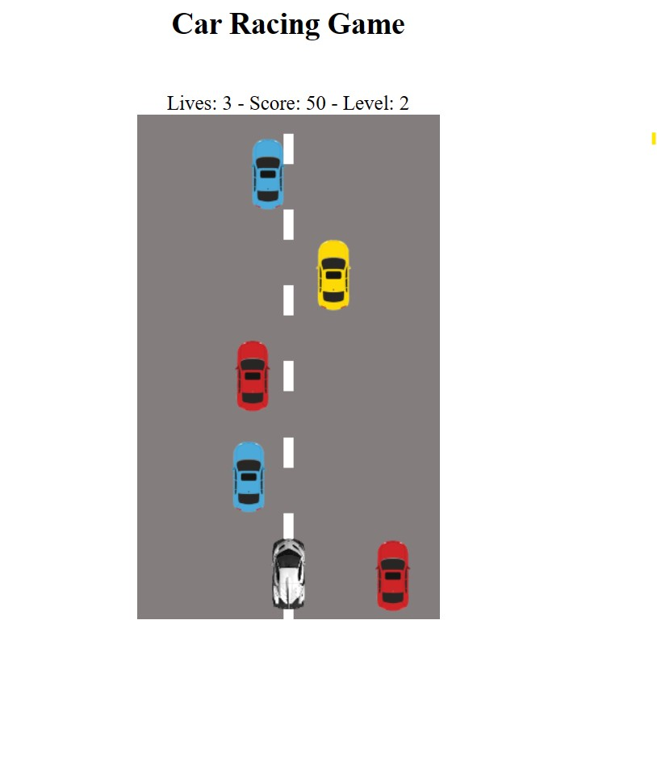

# Car Racing Game

Make some spaghetti code and play around with rxjs.

### Installation

```sh
npm install
```

### Run

```sh
npm start
```

### Build

```sh
npm run build
```

### Preview

Live Review [here](https://car-racing-game.onrender.com/)



### Reference

- [Game Loop](https://www.learnrxjs.io/learn-rxjs/recipes/gameloop)
- [Car Racing Game](https://www.learnrxjs.io/learn-rxjs/recipes/car-racing-game)
